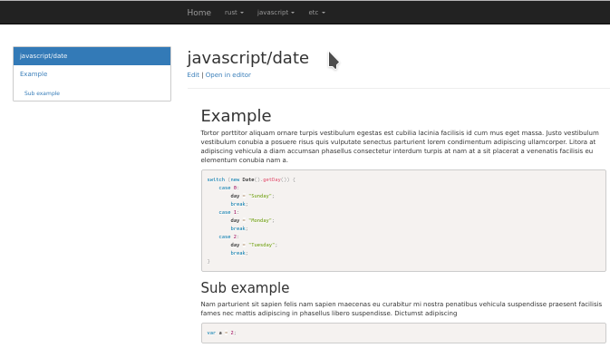

# Simplewiki

Simplewiki is a web server that presents a folder as a wiki page. The wiki page
supports viewing both markdown files and images.



## Usage

Go to the folder you want to look at, then run `simplewiki`.

For more options, run `simplewiki --help`.


## Installation

```
cargo install --git https://github.com/sighol/simplewiki
```

hello